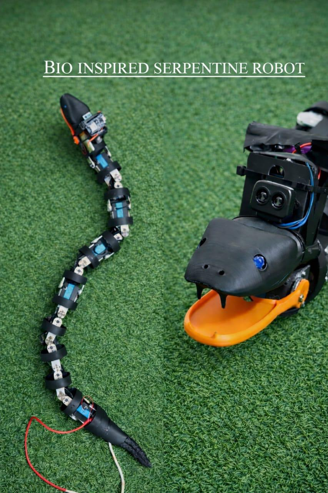
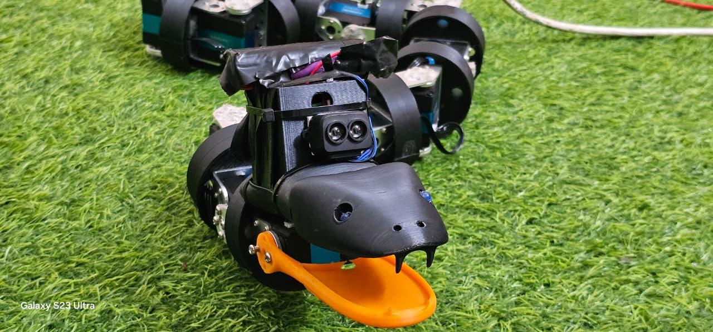
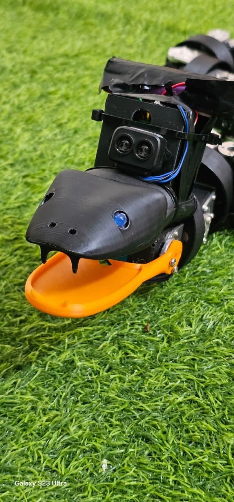
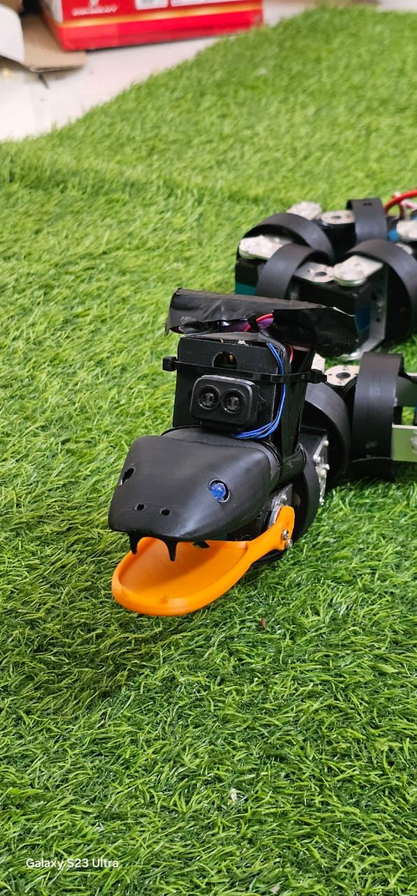
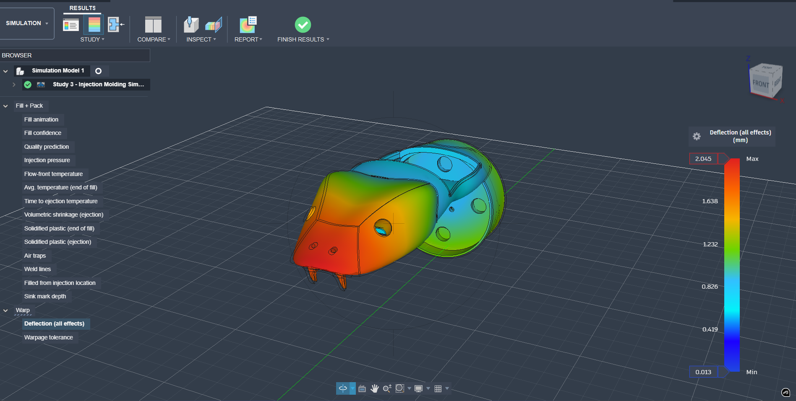
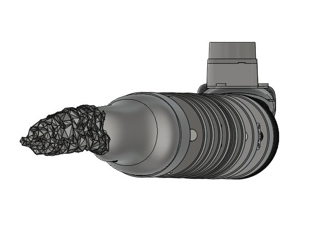
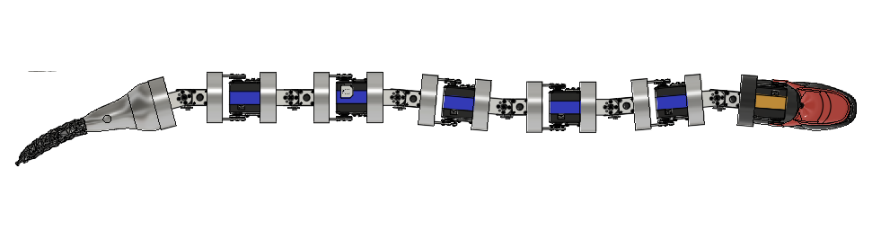
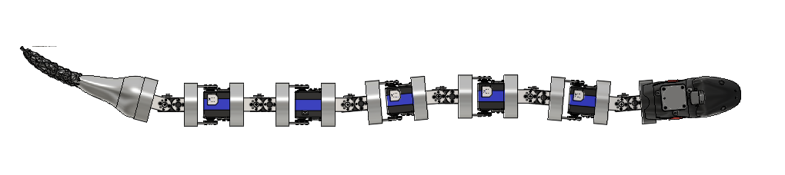

# 🐍 Bio-Inspired Serpentine Robot (Flipper)
### Integrated Multi-Gait Actuation, 3D CAD, and IoT Sensor Fusion Platform

<p align="center">
  
</p>

---

## 📖 Project Overview

This project presents a highly advanced **Bio-Inspired Serpentine (Snake) Robot** (code-named **Flipper**) designed for exploration, mapping, and search-and-rescue operations. By combining complex biological locomotion models with robust mechanical and electrical systems, the robot is capable of navigating narrow crevices, rough terrain, and hazardous environments.

The platform is split into three core pillars:
1. **Mechanical Design (CAD)**: A 13-segment 3D-printable modular serpentine body designed for single-degree-of-freedom lateral or vertical movements.
2. **Gait Control & Actuation**: Driven by **12x ST3020 High-Torque Serial Bus Servos** and managed wirelessly by a **Seeed Studio WiFi Board (ESP32-C3)** and a **Raspberry Pi 5** single-board computer.
3. **IoT Sensor Fusion & Dashboard**: A rich sensor payload (2D LiDAR, Flame, MQ Gas, Microphone, and Streaming Camera) combined via WebSockets to a React-based **Mission Control Dashboard** for real-time telemetry and control.

---

## 🛠️ Hardware Architecture & Components

The serpentine robot integrates industrial-grade actuators, wireless microcontrollers, a single-board computer, and various sensors to execute search-and-rescue missions:

| Component | Specification / Model | Purpose |
| :--- | :--- | :--- |
| **Actuators** | **12x ST3020 Serial Bus Servos** | Actuates the body joints for high-torque, precise angle control (0-4095 position resolution). |
| **Main Controller (SBC)** | **Raspberry Pi 5** | Handles high-level sensor processing, data logging, and running the primary scripts. |
| **Wireless Control Board** | **Seeed Studio ESP32-C3** | Generates the local WiFi access point, executes motion profiles, and controls the serial bus servo chain. |
| **Power Supply** | **12V 50A / 100W Power Supply** | Delivers stable and high-current power to support the combined load of the 12 heavy-duty servos. |
| **Sensing: 2D Mapping** | **RPLIDAR A1 M8** | Performs a 360-degree laser scan of the surrounding area for real-time mapping. |
| **Sensing: Vision** | **ESP32-CAM (or USB Camera)** | Streams live MJPEG video feeds to the dashboard. |
| **Sensing: Acoustics** | **Microphone Module** | Detects human voices or cries for help during rescue operations. |
| **Sensing: Hazards** | **Flame Sensor & MQ Gas Sensor** | Identifies fires, gas leaks, or smoke hazards in disaster zones. |
| **Sensing: Orientation** | **MPU6050 IMU** | Tracks pitch, roll, and yaw orientation of the robot's head. |

---

## 📐 Locomotion & Gait Equations

To replicate the slithering locomotion of biological snakes, the robot uses a **Serpenoid Curve** gait algorithm (first proposed by Shigeo Hirose). This formula controls the angular position of each segment relative to time and its position along the body.

### Serpenoid Curve Formula

For lateral undulation (slithering), the target angle $\theta_j(t)$ for the $j$-th segment servo is calculated as:

$$\theta_j(t) = \gamma + A \sin(\omega t + j \beta)$$

Where:
* **$\theta_j(t)$**: Target angle of the $j$-th joint at time $t$.
* **$A$ (Amplitude)**: Controls the curvature and width of the snake's body waves.
* **$\omega$ (Temporal Frequency)**: Controls the speed at which the wave propagates down the body (speed of locomotion).
* **$\beta$ (Spatial Frequency / Wavelength)**: Controls the number of waves present along the snake's body.
* **$\gamma$ (Bias / Offset)**: Directs the robot's heading (changing $\gamma$ steers the snake left or right).

### Exponential Smoothing ("Shock Absorber")

To prevent high-torque servos from jerking violently when the operator makes sudden adjustments on the joystick or sliders, the firmware implements an exponential smoothing filter on the wave parameters:

$$X_{\text{smoothed}} = X_{\text{smoothed}} + \alpha (X_{\text{target}} - X_{\text{smoothed}})$$

Where $\alpha \approx 0.05$ acts as a dampener to ensure smooth, natural transitions.

---

## 🗂️ Repository Structure

*   [CAD/](file:///c:/Users/sudha/snake_project/CAD): Contains the raw 3D CAD design files.
    *   [Robot_Serpantine.step](file:///c:/Users/sudha/snake_project/CAD/Robot_Serpantine.step): 3D mechanical assembly file of the serpentine robot.
*   [GUJJCOST-SENSOR_FUSION/](file:///c:/Users/sudha/snake_project/GUJJCOST-SENSOR_FUSION): IoT telemetry, sensor fusion, and dashboard.
    *   [Snake_Movement/](file:///c:/Users/sudha/snake_project/GUJJCOST-SENSOR_FUSION/Snake_Movement): ESP32-C3 firmware and gait command controllers.
    *   [firmware/](file:///c:/Users/sudha/snake_project/GUJJCOST-SENSOR_FUSION/firmware): ESP32 and Arduino firmware for sensor hubs.
    *   [sensor_fusion_dashboard/](file:///c:/Users/sudha/snake_project/GUJJCOST-SENSOR_FUSION/sensor_fusion_dashboard): React front-end visualizing the LiDAR maps and sensor telemetry.
*   [STServoController_GUI/](file:///c:/Users/sudha/snake_project/STServoController_GUI): Configuration, calibration, and diagnostics utility for ST3020 servos.
*   [media/](file:///c:/Users/sudha/snake_project/media): Photos, screenshots, and videos of the robot in action.

---

## 📸 Photo Gallery

### Mechanical Design & Assembled Robot

<p align="center">
  
  
  
</p>

### Mission Control Dashboard & Telemetry GUI

The React-based Sensor Fusion Dashboard collects telemetry from all sensors and paints a 2D LiDAR scanning map:

<p align="center">
  
  
</p>

The STServo GUI offers low-level calibration and individual control of the 12 ST3020 servos:

<p align="center">
  
  
</p>

---

## 🎥 Video Gallery

### Locomotion Demonstration Clips

Here are videos demonstrating the snake's actual mechanical movement in 3D-printed segments:

**🐍 Autoplaying Locomotion Demo (GIF)**
<p align="center">
  
</p>

**Other Video Links:**
* [Locomotion Demo 2](https://github.com/kakumani123sudhakar/Serpantine_snake_Robot/raw/main/media/snake_locomotion_demo_2.mp4)
* [Locomotion Demo 3](https://github.com/kakumani123sudhakar/Serpantine_snake_Robot/raw/main/media/snake_locomotion_demo_3.mp4)
* [Locomotion Demo 4](https://github.com/kakumani123sudhakar/Serpantine_snake_Robot/raw/main/media/snake_locomotion_demo_4.mp4)
* [Locomotion Demo 5](https://github.com/kakumani123sudhakar/Serpantine_snake_Robot/raw/main/media/snake_locomotion_demo_5.mp4)
* [Locomotion Demo 6](https://github.com/kakumani123sudhakar/Serpantine_snake_Robot/raw/main/media/snake_locomotion_demo_6.mp4)

### Software Screen Recordings

Here are screen recordings showcasing the real-time sensor fusion telemetry and mapping dashboard:

* [Dashboard Live Scan & Feeds](https://github.com/kakumani123sudhakar/Serpantine_snake_Robot/raw/main/media/dashboard_screen_recording_1.mp4)
* [GUI Telemetry Log](https://github.com/kakumani123sudhakar/Serpantine_snake_Robot/raw/main/media/dashboard_screen_recording_2.mp4)

---

## ⚙️ How to Setup and Run

### 1. Actuation & Servo GUI Setup
Power on the ST3020 servos using the **12V 50A Power Supply**. Connect the servo controller serial bus to your PC or Raspberry Pi, and run:

**On Windows:**
```cmd
.\STServoController_GUI\start-servo-controller-easy.bat
```

**On Linux/macOS:**
```bash
cd STServoController_GUI
chmod +x start-servo-controller.sh
./start-servo-controller.sh
```
Access the configuration page at `http://localhost:3000`.

### 2. Sensor Fusion & Telemetry Dashboard
1. Flash the ESP32-Bridge firmware located in `GUJJCOST-SENSOR_FUSION/firmware/esp32_bridge`.
2. Connect the Arduino Nano to the sensor payload (Flame, Gas, Microphone, IMU) and flash `nano_sensor_hub.ino`.
3. Power the ESP32-Bridge, which will broadcast a local WiFi access point.
4. Launch the dashboard React app:
   ```bash
   cd GUJJCOST-SENSOR_FUSION/sensor_fusion_dashboard
   npm run dev
   ```
